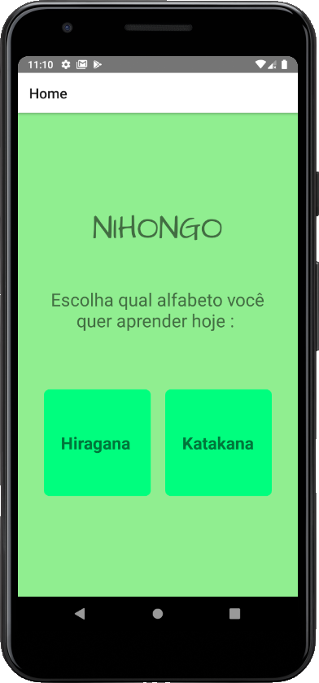
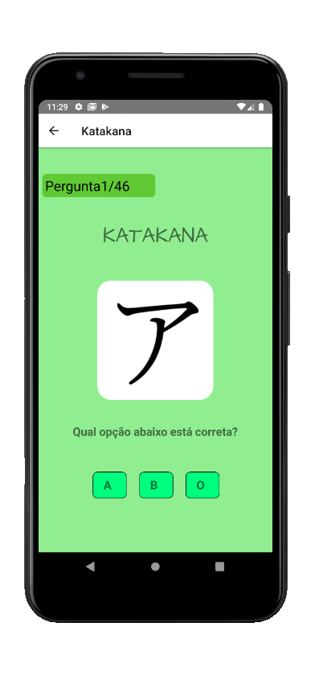
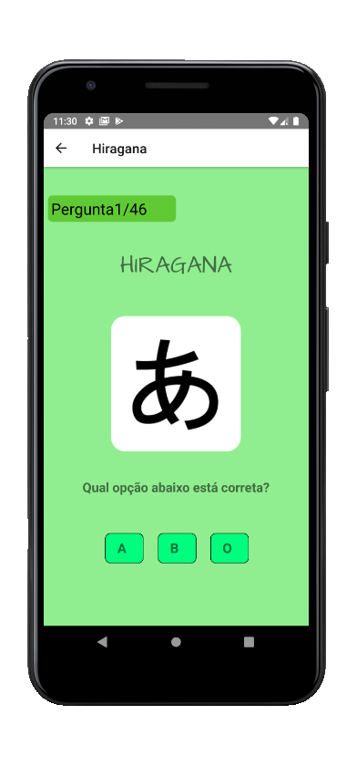

# Nihongo-React-Native-APP

## Preview

   
    
     

## Sobre o APP-Nihongo

Conheça os caracteres japoneses, memorize todas as 46 letras, escolha entre Hiragana ou Katakana e responda adequadamente de acordo com a imagem(letra do alfabeto japones).
#### Breve na PlayStore.

## Installation

Clone o Repositório com `git clone com https://github.com/Leojunkes/Nihongo `.

`cd Nihongo`
`npm start ou yarn start`
`npx react-native run-android` Emulador Android

Ou abra o app com EXPO, baixando na Playstore e utilizando em seu celular físico.

## License

This project is licensed under the MIT License - see the LICENSE.md file for details.

